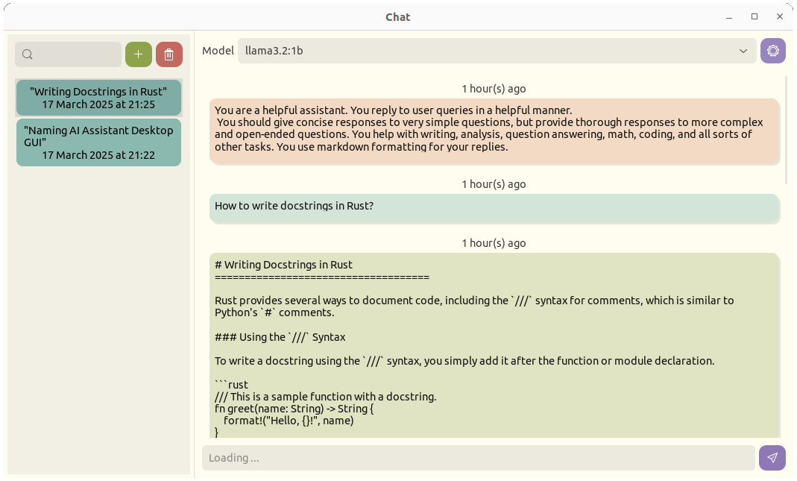

<div align="center">

# Pincer Chat


<em>PincerChat, a desktop GUI for interacting with local LLMs served with <a href=https://ollama.com/>Ollama</a></em>



</div>

## Features

- Simple and responsive UI.
- Response streaming.
- Chat history.

## Roadmap

- [ ] Markdown rendering.
- [ ] Option to upload and use files and documents.
- [ ] Compiled Linux, macOS and Windows executables.

## Getting Started

- Download and install [Ollama](https://ollama.com/download)

- Start ollama server:

  ```shell
  ollama serve
  ```

- Start the application:

  ```shell
  cargo install --git https://github.com/AnesBenmerzoug/pincer-chat.git
  ```
